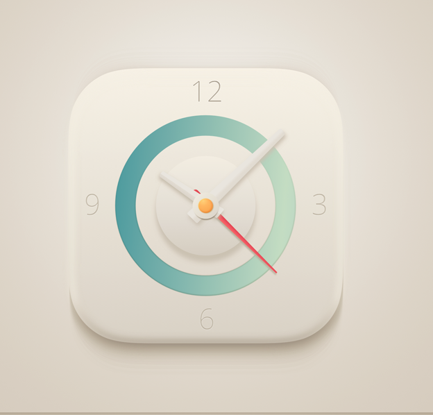
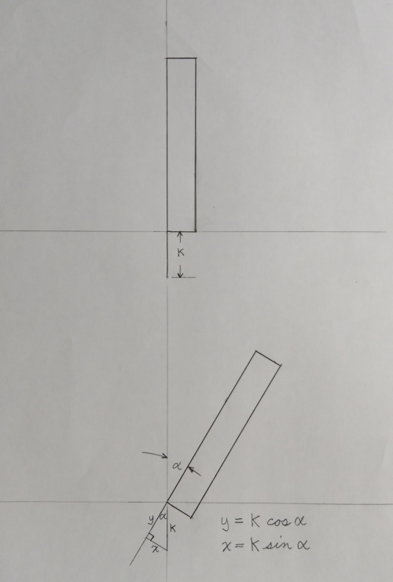

# JavaScript-Animated Analog-styled Clock

This was a collaborative project to build an animated analog clock styled from the following image:

[Bobby Stewart](https://github.com/rtstewart) was charged with authoring the HTML and CSS to emulate the analog clock image above. [Kevin Lufkin](https://github.com/klufkin) was charged with authoring the JavaScript to provide clock movement corresponding to the actual local time.

[view GitHub hosted solution](https://rtstewart.github.io/animated-analog-clock/clock-analog-QA.html)

## Notable HTML/CSS Challenges

HTML/CSS Collaborator: Bobby Stewart

### Suitably positioning the clock hands for rotation

The clock hands were created with `
` elements. By default, an element's origin, which is what it would rotate about, is at the center, both vertically and horizontally, of the element. In order to rotate the clock hands with a "normal" appearance, it was necessary to translate the hand element and possibly its origin, depending on whether it was to be directly or indirectly rotated - this will be explained below.

A `
` element was used for the clock itself to contain all of the clock elements including the hands. With the clock position property set to relative, things could be positioned as desired relative to the clock `
`.

Next, in creating a hand with its position property set to absolute, it can then be positioned within the clock `
` without any layout interference to, or by, any other element. When given a height value noticeably greater than width, this would create the beginning of a hand in the 12 o'clock position - [view here](https://rtstewart.github.io/animated-analog-clock/clock-hand-steps_01.html). An absolutely-positioned hand is placed at the clock center by using the combination of `top: 50%; left: 50%; transform: translate(-50%, -y%)`. Recall that with `top` and `left`, the provided percent values refer to percent of the parent element height and width respectively. So `top: 50%; left: 50%;` places the left edge of the hand at the clock vertical centerline, and the top edge at the clock horizontal centerline - [view here](https://rtstewart.github.io/animated-analog-clock/clock-hand-steps_02.html).

Now, to translate the hand to a position which emulates 12 o'clock, and with the intended center of rotation at the clock center, we use `transform: translate(-50%, -y%)`. We'll get to the *y* value in a minute. For the `translate` percentage values, they refer to percentage of the element width and height values, *not* the parent. So this relocates the hand by 50% of its width back to the left (negative x value), and *y*% of its height upward (negative y value). If we were to use *100* for *y*, the bottom edge of the hand would lie at the horizontal centerline of the clock `
` - [view here with y = 100%](https://rtstewart.github.io/animated-analog-clock/clock-hand-steps_03.html). But since we want to have the hand *not* rotate by the bottom edge, we use some number less than *100* for *y* - whatever suits the design. This will now place the clock hand in the 12 o'clock position with its width-wise center at the vertical centerline of the clock, and the intended rotational "y-coordinate" at *y*% of the hand's height below the top edge of the hand, and this intended center will now coincide with the center of the clock `
` - [view here with y = 87.5%](https://rtstewart.github.io/animated-analog-clock/clock-hand-steps_04.html).

If we wanted to rotate the hand element directly, about our intended newly-created rotational point, we will also need to apply `transform-origin: 50% y%;`. This would relocate the origin of the element from the default origin of 50% (of its width), 50% (of its height), i.e., its center both vertically and horizontally, to match our intended point of rotation created as discussed above - [view direct hand rotation here, which requires hand translation each time it is rotated](https://rtstewart.github.io/animated-analog-clock/clock-hand-steps_05.html). As it turns out, the rotation of the hand will be more easily accomplished by placing it in a `
` container whose rotational center coincides with the clock, and then rotating that `
` as necessary. This is easier because if attempting to rotate the hand directly, the hand element translation will have to be applied each time the hand element is rotated - [view here what happens if element translation is not performed with rotation](https://rtstewart.github.io/animated-analog-clock/clock-hand-steps_06.html).

So to create this hand-containing `
`, which has a rotational center that coincides with the clock and does not require translation, we make the containing `
` absolutely positioned with `width: 100%; height: 100%;`. This creates a `
` the exact size of the clock `
` and contained by the clock `
`, forcing a coinciding center, which will also size-adjust with the clock if necessary. This is the method used to create, locate, and provide for rotation-ready hands to act on with either CSS animation, or JavaScript - [view rotating the hand-containing `
` here](https://rtstewart.github.io/animated-analog-clock/clock-hand-steps_07.html).

### Alternative solution to provide easy-to-rotate clock hands

As an alternate solution to providing "easy" hand rotation, with a bit more calculation, the hands can be placed and their origin transformed in a way that avoids `transform: translation` and therefore the hand can be rotated directly without simultaneous translation - [view here](https://rtstewart.github.io/animated-analog-clock/clock-hand-steps_08.html).

### Dynamic Shadow-casting and highlighting of clock arms

In an attempt to provide a bit more dimension and realism to the clock, I chose to apply what I'll call dynamic shadow-casting and highlighting to the clock hands. If you have the patience to watch the clock hands, you will notice that the shadows cast, and the highlights of the hands, are appropriate for each hand's position assuming the light source comes roughly from directly above - that is as I interpret the provided image that I was to emulate with HTML/CSS (see above analog clock image).

This was accomplished through the JavaScript that also provided the clock movement. I applied the `box-shadow` CSS property to the hands along with the use of `Math.sin()`, and `Math.cos()` to vary the `box-shadow` x and y component values within the JavaScript, clock.js, that my partner Kevin Lufkin wrote to provide the correct time and clock movement. The image below shows a simple rendering of a clock hand at 12 o'clock and then at some arbitrary angle alpha (&alpha;). Refer to that image for the following. If I assumed I wanted a downward cast shadow of length k at 12 o'clock (since I am assuming the light source to be directly above), then the x and y projections of the shadow as the clock hand rotates would be given by x = k &times; sin(&alpha;), and y = k &times; cos(&alpha;). Recall that for `box-shadow` x and y component values, positive x projects to the right, negative x projects to the left, positive y projects downward, negative y projects upward. Since sin(&alpha;), and cos(&alpha;) oscillate between +1 and -1, this also appropriately provides sign changing for the directions of the shadows if the `box-shadow` property is correctly defined.

The same concept was applied to clock hand highlighting to hightlight the hands appropriately according to their orientation relative to the assumed light source.

## Notable JavaScript Challenges

JavaScript Collaborator: Kevin Lufkin

### Topic 1

...

### Topic 1

...